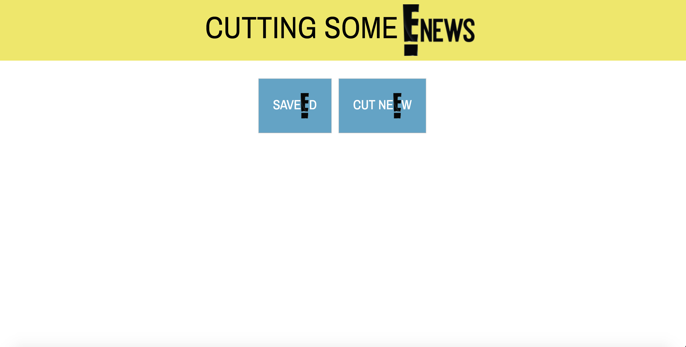
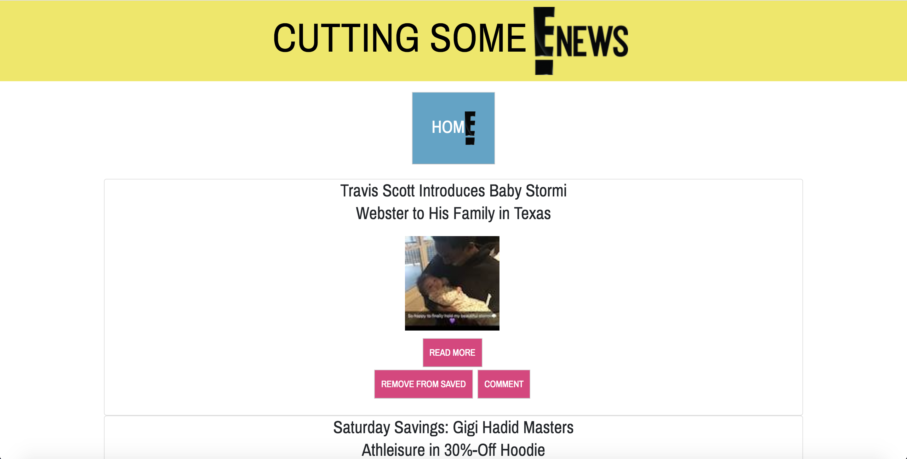
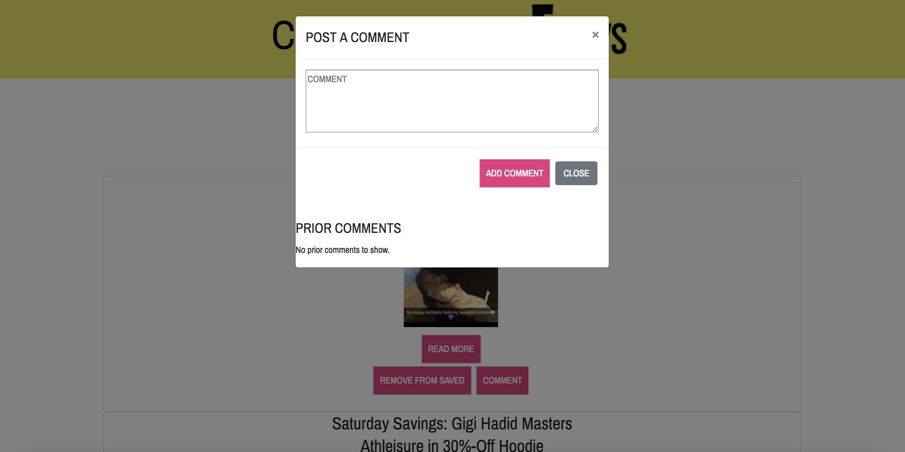
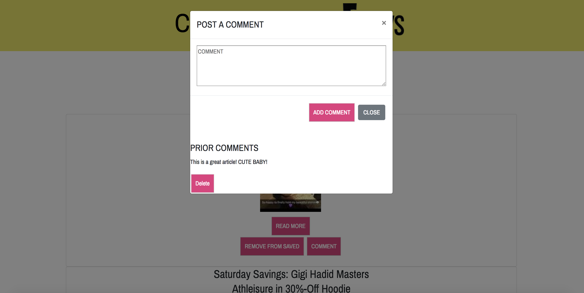

# CUTTING SOME E!News
## News Scraping App

## How It Works
## 1. Cut new E!
Click the "Cut New" button to scrape the E! News website for new articles.

Once the Headlines appear you can:
1. Click the "Read More" button to be directed to the full article on the E! New website
2. Click the "Save Headline" button to save this headline to view later

## 2. View saved E!
Click the "Saved" button on the home screen to see saved headlines.

With saved headlines you can:
1. Click the "Read More" button to be directed to the full article on the E! New website
2. Click the "Remove from Saves" button to send this headline back to the home screen
3. Click the "Comment" button to view prior comments on this headline and/or leave your own comment

## 3. Comment on E!
Upon clicking the "Comment" button, a modal will appear with a text box to leave a comment on this headline.

If others have left comments before you, they are visible at the bottom of the modal under the "Prior Comments" heading.

## NPMs Used
* Body-Parser
* Cheerio
* Express
* Express-Handlebars
* Mongojs
* Mongoose
* Morgan
* Request

## Run
* Locally: node server.js
* Online: https://shrouded-harbor-12126.herokuapp.com/
